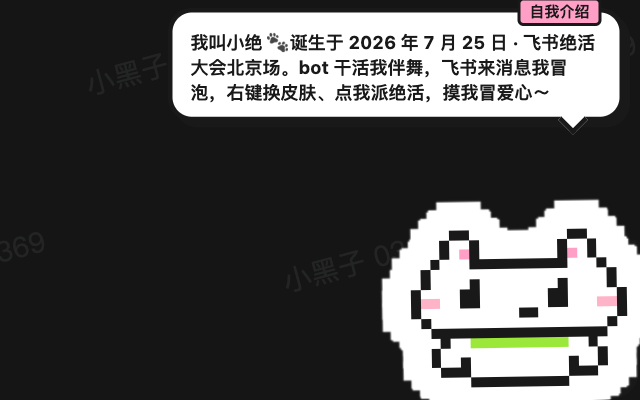
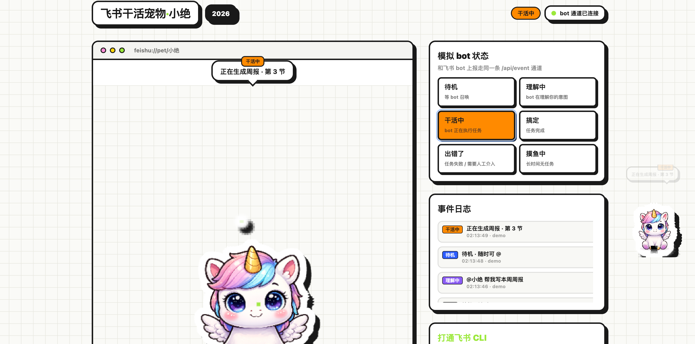
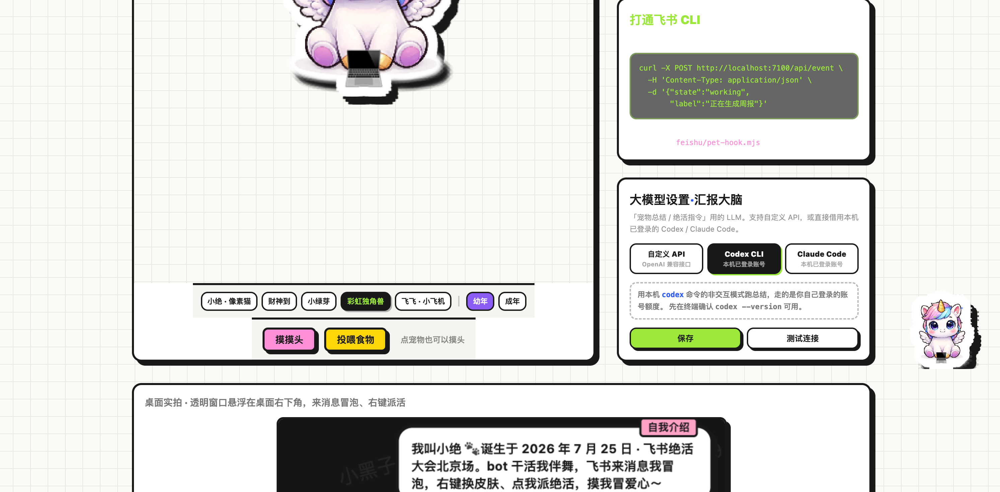

# 小绝 · 飞书干活宠物（feishu-pet）

**飞书 bot 在替你干活，桌面上得有个小家伙让你看见它在干活。**

| 桌面悬浮实拍 | 看板 · 干活中 | 看板 · 换装与设置 |
|---|---|---|
|  |  |  |

> 小绝诞生于 2026 年 7 月 25 日 · 飞书绝活大会北京场，画风来自大会点位海报的贴纸语言。

<div align="center">


</div>

---

## 我为什么做这个

现在大家的飞书里都养着几个 bot：写周报的、跑流程的、回消息的。

但 bot 干活是个黑盒。它什么时候开始干、干到哪一步、干成了还是干砸了，你得自己切回飞书、翻到那个会话、往上翻聊天记录才知道。群里有人 @ 你、私聊来了新消息，也一样——飞书不在前台，世界就安静得好像什么都没发生。

小绝是把这层状态**从飞书里拽出来、放到桌面上**的一只宠物：

- bot 开始干活，它抱起电脑敲代码；
- bot 干完了，它蹦起来撒花；
- 群里有人 @ 你，它歪头冒泡；私聊来消息，气泡直接告诉你谁说了什么；
- 你扫一眼桌面就知道现在该不该回去看飞书。**不用切窗口，状态自己长脚走到你眼前。**

它不止是个状态灯。点一下气泡，直接跳进飞书那条消息所在的会话；右键菜单能给它派活——整理今日待办、总结过去 6 / 12 / 24 小时的飞书消息，它跑去翻你的群和私聊，让大模型总结好，再私聊发回给你。

## 它能干什么

1. **六档状态实时联动**——待机 / 理解中 / 干活中 / 搞定 / 出错了 / 摸鱼中。你的 bot 在关键节点 POST 一个事件（一行 curl），小绝立刻换动作换台词。协议极简，任何语言任何框架都能接。
2. **飞书消息气泡提醒**——监工（`feishu/group-watcher.mjs`）轮询你指定的群 + 最近活跃的私聊，新消息变成宠物头顶的气泡；@你、@所有人、刷屏、发图发文件，各有专属反应。**气泡带 ↗ 角标，点一下直接 applink 唤起飞书跳到对应会话。**
3. **小绝的绝活**——右键菜单派活：「整理今日待办」「过去 6 / 12 / 24 小时消息总结」。lark-cli 按时间窗捞消息 → LLM 生成待办清单或摘要 → 看板展示 + 私聊发你。每天 18:00 还有一份自动日报。
4. **大模型自己选**——看板里可视化切换 LLM 后端：自定义 OpenAI 兼容 API（baseUrl + key + model）、本机 Codex CLI、本机 Claude Code CLI。配置即存即用，不用重启。没有 key 的新用户直接选 CLI 模式，用自己已登录的账号就能跑。
5. **消息归档看板**——宠物身上都是碎片化的气泡，想看全的时候打开 `http://localhost:7100/archive`（看板「事件日志」右上角和宠物右键菜单都有入口）：消息提醒 / 绝活汇报全文 / 干活指令，按天分组持久化归档，支持筛选和搜索，每条消息带「去飞书看 ↗」直达会话。
6. **换装与形态**——5 套卡通贴纸皮肤（像素猫 / Q 版财神 / 小绿芽 / 彩虹独角兽 / 飞书配色小飞机）× 幼年 / 成年两种形态，右键即换，重启保持。
7. **一只懂规矩的宠物**——按住拖动、单击摸头冒爱心、双击打开“小绝助手”对话窗口（顶部可展开今日待办 / 审批 / 日程，`Esc` 关闭）、右键菜单、投喂食物、10 分钟没活干自动摸鱼、鼠标穿透挂着不碍事（⌘⌥P 随时恢复）、**像素级点击穿透**（点在透明区域直达桌面，只有点在它身上才响应）。
8. **飞书工作台**——`http://localhost:7100/workbench` 集中处理审批、任务和日程。审批支持递归解析表单 JSON、附件元数据列表（默认不下载）、带内容哈希缓存的自动 LLM 风险评估、飞书深链，以及填写理由后二次确认通过/拒绝；任务支持手动和自然语言创建、修改、完成；日程支持普通日程/视频会议、参与人、地点和提醒。所有自然语言写操作都先生成结构化预览，再由用户确认执行。

## 快速开始

需要 Node.js ≥ 20 和 macOS。

```bash
npm install
npm run pet        # 构建 + 启动桌面宠物（日常启动用 npm run pet:run）
```

宠物窗口内嵌事件服务器（`desktop/server.cjs`，:7100），看板同时挂在
`http://localhost:7100/`，**不依赖浏览器和 Vite 也能跑**。

打通飞书消息感知，再额外装一个 [lark-cli](https://github.com/larksuite/cli) 并登录：

```bash
cp feishu/.env.local.example feishu/.env.local   # 改成你的群 chat_id 和 open_id
npm run pet:watch                                # 启动监工（PET_REPORT_DRYRUN=1 时总结只上看板不发飞书）
```

两个必配项的获取方式：`lark-cli im +chat-list --as user` 找 `chat_id`，
`lark-cli contact +me --as user` 找 `open_id`。

工作台操作的是用户自己的审批、任务和主日历，需要额外完成用户授权：

```bash
lark-cli auth login --scope "approval:task:read approval:instance:read approval:task:write task:task:read task:task:write calendar:calendar.event:read calendar:calendar.event:create calendar:calendar.event:update"
```

应用也需要在飞书开放平台开通相同 scope。工作台顶栏会检测用户 token 状态，授权过期时显示并可复制上述最小权限命令。日历通过飞书的 `<primary>` 别名操作当前用户主日历，不需要组织策略可能限制的 `calendar:calendar.calendar:readonly`。审批通过/拒绝属于高风险写操作，必须在界面确认具体审批和动作后才会提交，审批意见可留空。

## 接进你自己的 bot

在你 bot 干活的代码里，关键节点 POST 一下就行：

```bash
curl -X POST http://localhost:7100/api/event \
  -H 'Content-Type: application/json' \
  -d '{"state":"working","label":"正在生成周报"}'
```

六档状态：`idle` / `thinking` / `working` / `success` / `error` / `sleeping`。
也可以直接用 `feishu/pet-hook.mjs` 脚本，或参考 `feishu/pet-bot.example.mjs`
（飞书官方 SDK 长连接模式，不用公网回调，群里发「摸摸」「投喂」就能逗宠物）。
完整协议见 [feishu/README.md](feishu/README.md)。

## 目前的边界（诚实版）

- 只测过 **macOS**。Electron 本身跨平台，但托盘图标、快捷键、applink 唤起都没在 Windows / Linux 上验证过，**欢迎 PR**。
- 消息感知依赖 lark-cli 的本机登录态，走的是你的用户权限，不是独立 bot 应用；飞书侧限流策略变了可能会影响轮询。
- 飞书 CDN 附件默认只展示元数据，不会自动加载文件内容；签名 URL 在发送给 LLM 和计算缓存哈希前会被隐藏。点击“按需打开”后，PDF 可能因 CDN 响应头而直接下载。
- 还没有 electron-builder 打包，分发需要本机有 Node 环境（路线图第一项）。
- 私聊会话的 applink 跳转依赖飞书 Mac 客户端，没装客户端会打开网页版。

## 路线图

- [ ] electron-builder 打包成 .app / .dmg（免 Node 环境分发）
- [x] 多皮肤与换装（5 皮肤 × 幼年/成年双形态）
- [x] 消息归档看板（/archive · 消息/汇报/指令按天分组持久化）
- [x] 飞书工作台（审批 / 任务 / 日程 / 自然语言预览确认）
- [ ] 桌面上随机游走 / 卖萌待机动作
- [ ] 互动回执：被摸后 bot 在飞书群里回一句撒娇文案
- [ ] Windows / Linux 适配

## 目录

```
desktop/    Electron 主进程 / 托盘 / 内嵌事件服务器
feishu/     飞书外挂：监工 + hook 脚本 + LLM 客户端 + 互动 bot 示例
src/pet/    像素 sprite 与动画舞台（网页看板与桌面窗口共用）
public/     皮肤形象 / 海报画风素材 / 实拍截图
pet.html    桌面宠物窗口页（透明底）
index.html  网页调试看板
```

## License

MIT © 黑哥 (heigeai)
